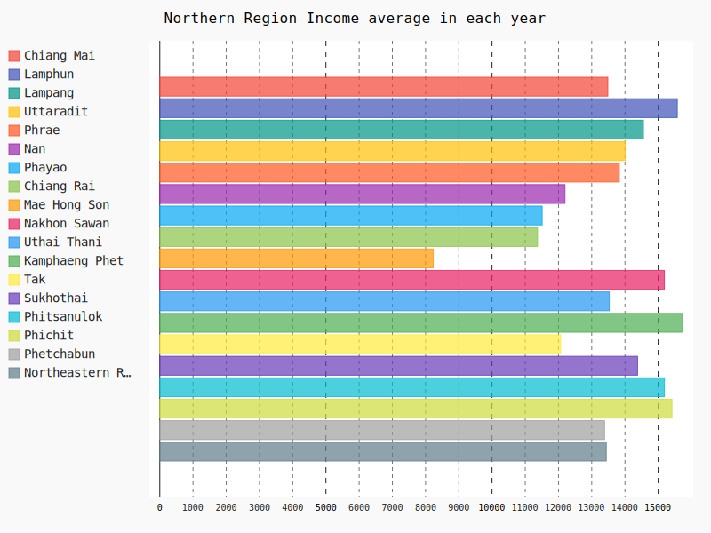
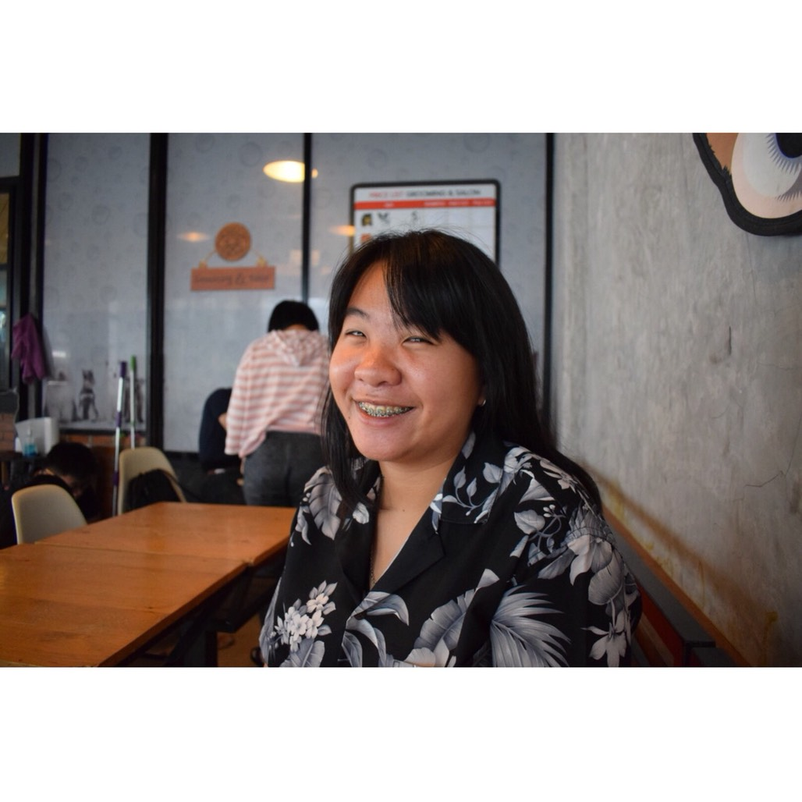

<h1 id='top'>Project AVG</h1> 

This project is part of subject Problem Solving in Information Technology (PSIT) 
:school: Faculty of Information Technology, King Mongkut's Institute of Technology Ladkrabang (KMITL).  

## Objective :dart:
Project นี้มีวัตถุประสงค์จัดทำขึ้นเพื่อให้ผู้ที่สนใจได้ศึกษา วิเคราะห์ข้อมูลเกี่ยวกับรายได้เฉลี่ยต่อเดือน - ต่อครัวเรือน จำแนกตามภาค  และจังหวัด พ.ศ. 2541 - 2558
ซึ่งรวบรวมรายได้ทั้งหมดของครัวเรือน ทั้งรายได้จากอาชีพหลัก รายได้จากอาชีพรอง อาชีพเสริม  รายได้อื่น ๆ และรายได้ที่เกิดจากการทำ การปลูก การเลี้ยงและการหาไว้กินเอง (แล้วคิดคำนวณเป็นค่าเฉลี่ยของแต่ละปี)  

## Sample Graph :bar_chart:

## Author :notebook_with_decorative_cover:
|||||
|:---:|:---:|:---:|:---:|
|[ZeroHX](https://github.com/ZeroHX)|[jowkha](https://github.com/jowkha)|[Suphasan](https://github.com/Suphasan)|[jinnygym](https://github.com/jinnygym)|
|นายจักรวาล อินทรัตน์ชัยกิจ -61070023-|นางสาวฐานิดา สำเนียง -61070043-|นายศุภสัณห์ ศิลาโรจน์ -61070227-|นางสาวศุภิสรา ชีวนันทพร -61070230-|

## Credits :snake:
* Dataset: [รายได้เฉลี่ยต่อเดือนต่อครัวเรือน จำแนกตามภาค และจังหวัด พ.ศ. 2541 - 2558](https://data.go.th/DatasetDetail.aspx?id=7049410f-5bb8-4c75-9e94-112ca18b63e2) 

  

   

