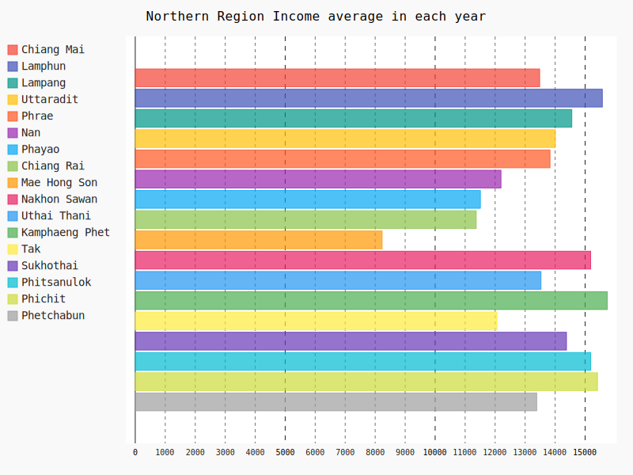

<h1 id='top' style="font-size:500px;">:money_with_wings: Average income Analysis (Project AVG) :money_with_wings:</h1>

This project is part of subject Problem Solving in Information Technology (PSIT) 
Faculty of Information Technology, King Mongkut's Institute of Technology Ladkrabang (KMITL).  

  

<a href="https://www.it.kmitl.ac.th/~it61070230/ProjectAVG/index.html"><h2 id='web'>:triangular_flag_on_post: Go to Website :triangular_flag_on_post:</h2></a>
  

 

<h2 id='obj'>Objective :dart:</h2> 

Project นี้มีวัตถุประสงค์จัดทำขึ้นเพื่อให้ผู้ที่สนใจได้ศึกษา วิเคราะห์ข้อมูลเกี่ยวกับรายได้เฉลี่ยต่อเดือน - ต่อครัวเรือน จำแนกตามภาค  และจังหวัด พ.ศ. 2541 - 2558
ซึ่งรวบรวมรายได้ทั้งหมดของครัวเรือน ทั้งรายได้จากอาชีพหลัก รายได้จากอาชีพรอง อาชีพเสริม  รายได้อื่น ๆ และรายได้ที่เกิดจากการทำ การปลูก การเลี้ยงสัตว์และการหาของไว้กินเอง (แล้วคิดคำนวณเป็นค่าเฉลี่ยของแต่ละปี)  

<h2 id='graph'>Sample Graph :bar_chart:</h2> 
 

<h2 id='con'>Conclusion :bulb:</h2>

จากแนวโน้มของแต่ละกราฟจะเห็นว่าโดยรวมภาคที่มีรายได้เฉลี่ยครัวเรือนประเทศไทยมากๆส่วนใหญ่จะเป็นภาคกลาง ซึ่งจากกราฟ 10 อันดับต้นรายได้เฉลี่ยครัวเรือนประเทศไทยมีภาคกลางอยู่ด้วยกัน ถึง 7 จังหวัด ส่วนใหญ่จังหวัดที่มีค่ารายได้เฉลี่ยต่อครัวเรือนสูงมักจะเป็นจังหวัดที่มีการท่องเที่ยวเป็นส่วนใหญ่ทำให้รายได้สูงตามไปด้วย และส่วนใหญ่ค่ารายได้เฉลี่ยต่อครัวเรือนเพิ่มขึ้นทุกปี 

<h2 id='res'>Result :key:</h2>

ในผลการดำเนินการนั้น เราได้วิเคราะห์ข้อมูลเกี่ยวกับรายได้เฉลี่ยต่อเดือนต่อครัวเรือน จำแนกตามภาค และจังหวัด พ.ศ. 2541 - 2558 มีแนวโน้มที่เพิ่มสูงขึ้น-ลดลง เพื่อนำไปปรับใช้ในการลงทุนทางธุรกิจซึ่งหวังผลในระยะยาว หรือ การจัดการระบบทางเศรษฐกิจ และพร้อมรับมือกับสถานการณ์ในอนาคต

<h2 id='author'>Author :notebook_with_decorative_cover:</h2>

|||||
|:---:|:---:|:---:|:---:|
|[ZeroHX](https://github.com/ZeroHX)|[jowkha](https://github.com/jowkha)|[Suphasan](https://github.com/Suphasan)|[jinnygym](https://github.com/jinnygym)|
|นายจักรวาล อินทรัตน์ชัยกิจ -61070023-|นางสาวฐานิดา สำเนียง -61070043-|นายศุภสัณห์ ศิลาโรจน์ -61070227-|นางสาวศุภิสรา ชีวนันทพร -61070230-|

<h2 id='cr'>Credits :snake:</h2>

* Dataset: [รายได้เฉลี่ยต่อเดือนต่อครัวเรือน จำแนกตามภาค และจังหวัด พ.ศ. 2541 - 2558](https://data.go.th/DatasetDetail.aspx?id=7049410f-5bb8-4c75-9e94-112ca18b63e2) 

  
     * **Pandas**
     * **Pygal 2.4.0**   

